# HOSTING A STATIC WEBSITE USING S3 BUCKET AND CLOUDFONT
#

 A static website is a website that serves static content, meaning that it doesn't use server-side programming or databases to generate content dynamically. Instead, static websites contain pre-built HTML, CSS, and JavaScript files that are uploaded to a web server and served directly to visitors without any processing or modification.

### What is the aim of our project

The objective of the project is to host a static website using amazon S3 (Simple Storage Service) bucket and CloudFont (A global Content Distribution Network). 

## What is a  S3 Bucket
- An amazon S3 bucket is a container for storing objects (files and their metadata).
- To store an object, you:
    1. Create a bucket
    2. Upload the object to the bucket
- Once an object is in a bucket, you can:
    - Open it
    - Download it
    - Move it
- When you no longer need an object or bucket, you can:
    - Delete them to clean up your resources

Think of a bucket like a folder and an object like a file. You create a folder (bucket) and add files (objects) to it. Then, you can manage those files (objects) and delete them when you're done!

## What is an Amazon CloudFont
Amazon CloudFront is a fast, secure, and highly scalable content delivery network (CDN) that accelerates the distribution of static and dynamic web content, videos, and applications to users across the globe. With its vast network of edge locations and advanced caching capabilities, CloudFront reduces latency, improves page loads, and enhances user experience, making it an ideal choice for websites, mobile apps, and media streaming services.

## Steps to achieve the hosting of our static website

1 - First thing first, as a cloud engineer or potential cloud engineer, having an Amazon Cloud Account is quiet mandatory. Now at this point, ensure you are either logged in as the root user or an IAM user with the right privileges.

Create an  S3 Bucket after you log in to the AWS Console. Invoke the S3 Bucket resource and give it a name of your choice while following the naming convention

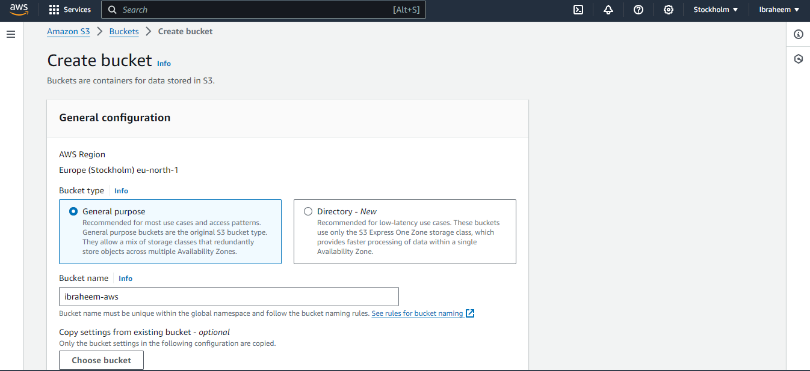

*   As seen in the screen shot above, the name of my bucket is `ibraheem-aws`

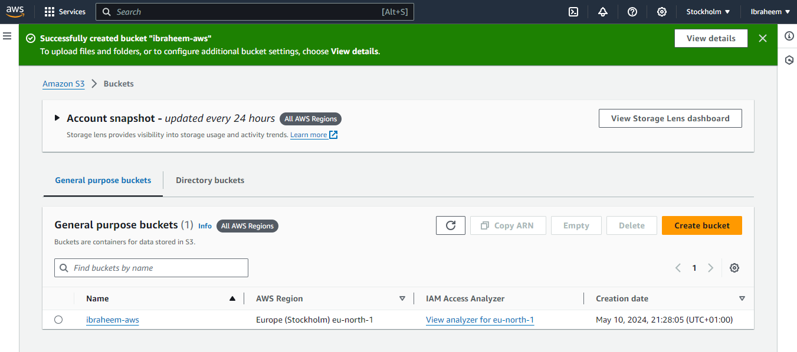

*   Image Created Successfully as evident from the image above

2 - Now that we have created our S3 bucket, we need to upload the static files of our website from wherever they are sitting into our bucket

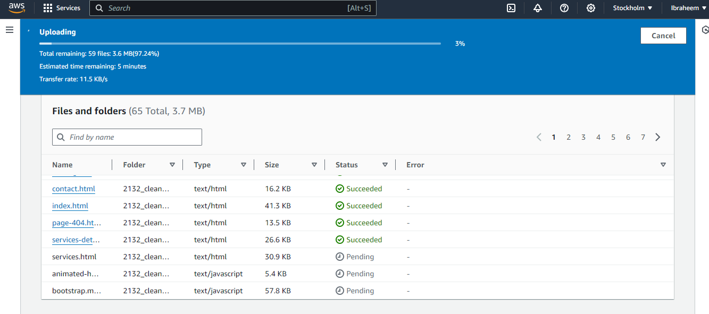

- The image above shows that the folder contents are being uploaded 

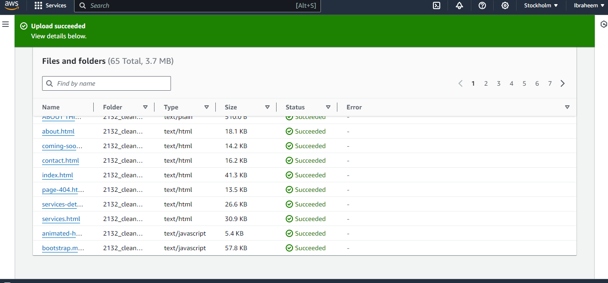

* Now the folder has been uploaded successfully into the `ibraheem-aws` bucket created as shown above.

Afte the folder has been uploaded into the S3 bucket, we need to dump the filed directly into the S3 bucket. 

 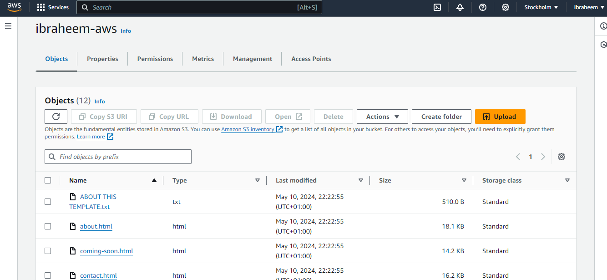

 Voila, we now have now created the S3 Bucket successfully and uploaded our files.

 3 - Lets now create the AWS CloudFont

 Similar to how we created the S3 bucket, we will also create the AWS CloudFont

 So, we search for the AWS CloudFont Resource and we create the CloudFont

 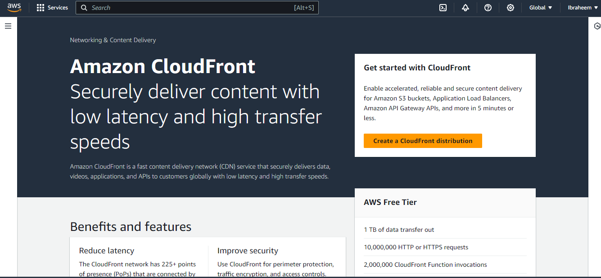
 
 -  Click on the Create a CloudFont distribution button to create the cloudfont

 When this is done, we then create a origin domain, this is done by selecting the S3 bucket name and creating an Origin Access Control setting. This is show below

 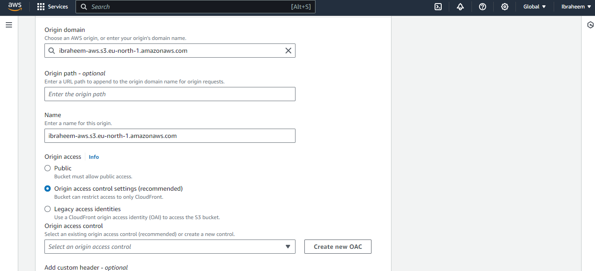

 When the OAC is created, we can then set our firewall settings  by selecting the `Enable security Protection` option 

 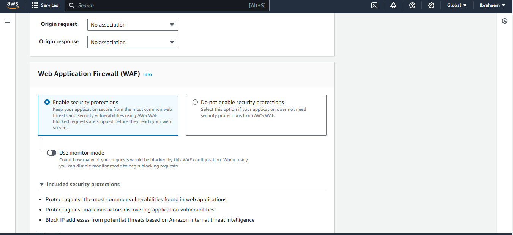

 Now create the distribution.  However, before the distribution set up is completed, be sure to enter the index.html file name in the Default root object field

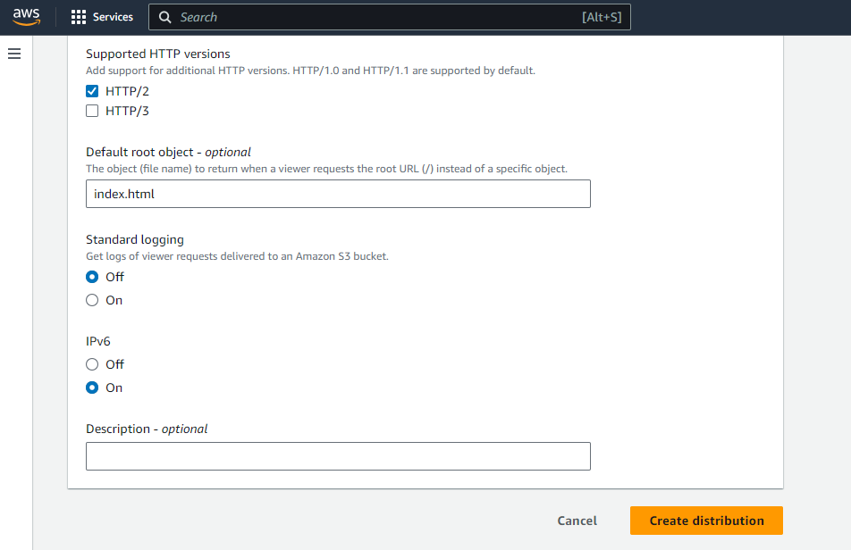

Next, copy the cloudfont distribution generated policy and paste into the permissions field of the S3 bucket

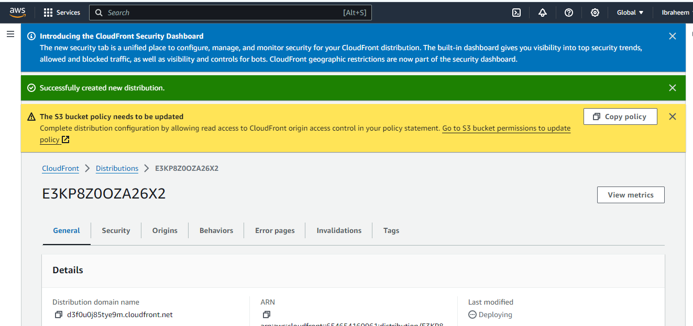

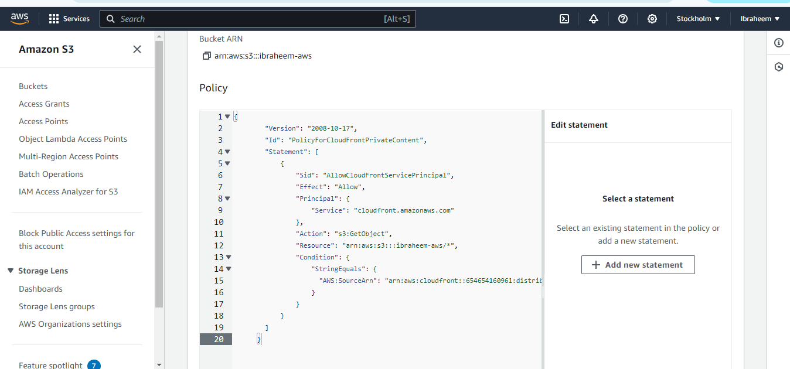

Finally, back at the cloudfont distribution, ensure to copy the distribution domain name and paste in the browser search field

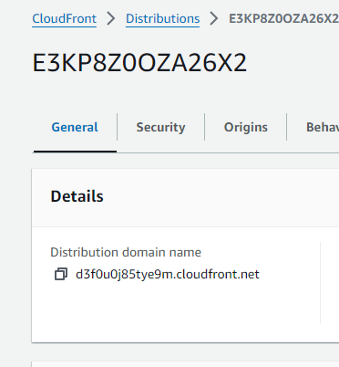

Confirm the website is working as expected 

